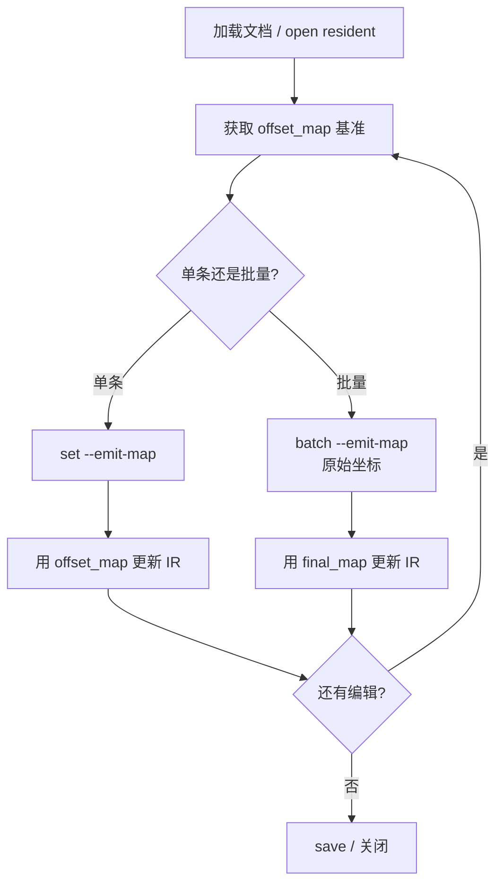

# OfficeCli v0.1.3 — Range 编辑与映射同步对接指南

本文档面向业务层 / IR 层，说明如何在 **range 编辑导致 DOM 节点变化** 后，稳定地完成脱敏、高亮、文本替换等批量操作，并持续拿到最新的文本↔路径映射。

---

## 1. 背景与问题

对 DOCX 执行 range 编辑（如 `/body/p[21]/r[1][169..179]`）时，底层会 **拆分 run**，导致：

- `r[1]` 可能变成 `r[1]` + `r[2]` + `r[3]`
- 后续仍用旧 path / 旧字符偏移会改错位置

**v0.1.3 提供的解法：**

| 能力 | 说明 |
|------|------|
| 区间文本替换 | `set --range-paths` 支持 `text=`，可与 `color` / `highlight` 同时使用 |
| 编辑后回吐映射 | `--emit-map` 返回最新 `TextOffsetMap` |
| batch 偏移重映射 | 同一 batch 内多条 range 编辑可用**原始坐标**，CLI 自动平移 |
| 旧→新 path 迁移表 | **batch 专属** `path_migrations`，告知哪些旧 path 失效、变成了什么 |
| 稳定段落锚点 | `OffsetSpan.id` 携带 `paraId`；可用 `/body/p[@paraId=xxx]` 寻址 |

---

## 2. 核心数据结构

### 2.1 TextOffsetMap（`--emit-map` / batch `final_map`）

```json
{
  "full_text": "Hello BRAVE-XL new world today",
  "meta": {
    "format": "docx",
    "total_chars": 30,
    "total_spans": 3
  },
  "spans": [
    {
      "start": 0,
      "end": 6,
      "path": "/body/p[1]/r[1]",
      "text": "Hello ",
      "element_type": "run",
      "id": "7c969739"
    },
    {
      "start": 6,
      "end": 14,
      "path": "/body/p[1]/r[2]",
      "text": "BRAVE-XL",
      "element_type": "run",
      "id": "7c969739"
    }
  ]
}
```

| 字段 | 含义 |
|------|------|
| `full_text` | 全文拼接（段落间 `\n`） |
| `spans[].start/end` | **Unicode 字符偏移**（非字节） |
| `spans[].path` | 当前 DOM 路径（1-based 索引，会随拆分变化） |
| `spans[].id` | 段落级稳定 ID（`w14:paraId`，run 拆分后不变） |
| `spans[].element_type` | `run` / `paragraph-break` / `cell` 等 |

> **注意：** 不带 `--with-offsets` 时 `extract-text` 仅返回 `format` + `text`；带 `--with-offsets` 时返回完整 `TextOffsetMap`（与 `--emit-map` 结构相同），适合**只读**查 path，无需触发编辑。

### 2.2 如何确认「某段文字」当前的真实 path

编辑后 DOM 会变，**不要猜 path**，用最新映射反查。有三种常用方式：

#### 方式 1：只读拉全量映射（推荐）

```bash
officecli extract-text doc.docx --with-offsets --json
```

返回每个 span 的 `path`、`text`、`start/end`。例如替换 `brave` → `BRAVE-XL` 后：

```
  0..  6 | /body/p[1]/r[1] | 'Hello '
  6.. 14 | /body/p[1]/r[2] | 'BRAVE-XL'    ← 目标文字的真实 path
 14.. 24 | /body/p[1]/r[3] | ' new world'
```

#### 方式 2：编辑时顺带拿映射

```bash
officecli set doc.docx --range-paths '...' text='...' --emit-map --json
# 或 batch ... --emit-map --json → 用 final_map
```

#### 方式 3：业务层在 IR 内反查（Java 伪代码）

```java
// 已知：全局字符偏移（来自脱敏规则 / 上一次 map）
OffsetSpan span = map.findSpanAtOffset(169);
String realPath = span.path();        // 例如 /body/p[21]/r[2]

// 已知：要找的文字内容
int globalStart = map.fullText().indexOf("BRAVE-XL");
OffsetSpan span2 = map.findSpanAtOffset(globalStart);

// 已知：逻辑段落 paraId + 段内偏移
map.spans().stream()
   .filter(s -> "7c969739".equals(s.id()))
   .filter(s -> s.text().contains("BRAVE-XL"))
   .findFirst()
   .map(OffsetSpan::path);
```

**反查规则：**

| 你手里有什么 | 怎么得到 path |
|-------------|--------------|
| 全局字符偏移 `N` | 找 `start ≤ N < end` 的 span → `span.path` |
| 目标文字字符串 | 在 `full_text` 里定位偏移 → 同上 |
| 逻辑段落 ID（paraId） | 筛 `spans[].id == paraId`，再按 text/段内偏移匹配 |
| 旧 path（编辑前） | **不可信**；必须重新 `extract-text --with-offsets` 或 `--emit-map` |

**验证 path 是否正确：**

```bash
# 用反查得到的 path 读节点，核对 text 是否一致
officecli get doc.docx '/body/p[1]/r[2]' --json
# → text 应为 "BRAVE-XL"
```

> `view --mode annotated` 只能看到段落级 path（`/body/p[N]: 全文`），**看不到 run 级**；需要 run 级 path 时必须走 `--with-offsets` / `--emit-map`。

### 2.3 Range 路径语法

```
/path[start..end]          # 元素内字符区间 [start, end)
/path[start..]             # 从 start 到末尾
/path[..end]               # 从开头到 end
/path                      # 整个元素
/path1[1..5],/path2[0..3]  # 多段，逗号分隔
```

**推荐写法：**

- **纯格式化（高亮/颜色）**：优先用段落级 range `/body/p[21][169..179]`，段落文本不变，偏移更稳定。
- **文本替换（改长度）**：必须用 `--emit-map` 或 batch `final_map` 刷新后再规划下一步。

---

## 3. 对接模式

### 模式 A：单次编辑 + 立即刷新映射（推荐默认）

适用于：resident 模式下的逐步编辑，或编辑间隔较长的场景。

```
1. 首次取图（任选其一）
   officecli extract-text doc.docx --with-offsets --json   # 只读全量映射
   officecli set doc.docx ... --emit-map --json   # 编辑时顺带取图（见下）

2. 业务层根据 spans 计算 range_paths

3. 执行编辑并刷新映射
   officecli set doc.docx \
     --range-paths '/body/p[21][169..179]' \
     text='张**' color='#FF0000' \
     --emit-map --json

4. 解析响应中的 offset_map，更新 IR 层缓存

5. 下一轮编辑基于新的 offset_map 重新计算 range
```

**set 响应示例：**

```json
{
  "result": "OK",
  "unsupported": [],
  "offset_map": { "...": "见 §2.1" }
}
```

### 模式 B：batch 批量编辑（同一次打开、原始坐标）

适用于：一次提交多条 range 脱敏/高亮，坐标均基于**编辑前**的同一份 map。

```
1. 业务层持有一份 offset_map（编辑前快照）

2. 构造 batch JSON，所有 range_paths 使用原始字符偏移

3. 执行
   officecli batch doc.docx '[
     {"command":"set","range_paths":"/body/p[1][6..11]","props":{"text":"X","color":"#00AA00"}},
     {"command":"set","range_paths":"/body/p[1][16..21]","props":{"text":"PLANET","color":"#0000FF"}}
   ]' --emit-map --json

4. 使用响应中的 `path_migrations` 更新 IR 里缓存的旧 path
5. 使用 `final_map` 作为 IR 层新基准
```

**batch `--emit-map` 响应结构：**

```json
{
  "results": [
    {
      "op": "set",
      "result": { "ok": "OK" },
      "offset_map": { "...": "该步执行后的映射" }
    }
  ],
  "final_map": { "...": "整批执行后的最终映射" },
  "path_migrations": [
    {
      "kind": "split",
      "before": {
        "path": "/body/p[1]/r[1]",
        "global_start": 0,
        "global_end": 27,
        "text": "Hello brave new world today"
      },
      "after": [
        { "path": "/body/p[1]/r[1]", "global_start": 0, "global_end": 6, "text": "Hello " },
        { "path": "/body/p[1]/r[2]", "global_start": 6, "global_end": 7, "text": "X" },
        { "path": "/body/p[1]/r[3]", "global_start": 7, "global_end": 12, "text": " new " },
        { "path": "/body/p[1]/r[4]", "global_start": 12, "global_end": 18, "text": "PLANET" },
        { "path": "/body/p[1]/r[5]", "global_start": 18, "global_end": 24, "text": " today" }
      ]
    }
  ]
}
```

#### path_migrations 字段说明（v0.1.3 新增，方便 IR 落库）

> **仅 batch `--emit-map` 输出 `path_migrations`。** 单次 `set --emit-map` 与 resident 只返回 `offset_map`（顶层字段为 `offset_map` / `result` / `unsupported`，无 `path_migrations`）。单条编辑若也想要迁移表，自行用「编辑前 baseline 的 spans」对比「`offset_map` 的 spans」即可（逻辑与 batch 相同）。

| 字段 | 含义 |
|------|------|
| `kind` | `split`（一拆多）、`path_changed`（同区域换节点）、`removed`（区域消失）；未变化的 span **不输出** |
| `before` | batch **开始前**的旧 path + 全局偏移 + 原文 |
| `after` | batch **结束后**覆盖同一逻辑区域的新 span 列表（可能 1 条或多条） |
| `before.stable_id` / `after[].stable_id` | 段落 `paraId`（**有才输出**，缺省字段不存在），可用于 IR 按段落归组 |

**IR 层落库建议（一张迁移表）：**

```sql
-- 示例表结构
CREATE TABLE path_migration (
  batch_id       VARCHAR(64),
  kind           VARCHAR(16),   -- split / path_changed / removed
  before_path    VARCHAR(256),
  before_start   INT,
  before_end     INT,
  before_text    TEXT,
  after_path     VARCHAR(256),  -- split 时多行
  after_start    INT,
  after_end      INT,
  after_text     TEXT,
  stable_id      VARCHAR(32),   -- paraId
  created_at     TIMESTAMP
);
```

**Java 更新 IR 伪代码：**

```java
JsonNode resp = officeCli.batch(doc, ops, /* emitMap */ true);

// 1. 按迁移表刷新 IR 中缓存的 path
for (JsonNode mig : resp.get("path_migrations")) {
    String oldPath = mig.get("before").get("path").asText();
    ir.markStale(oldPath);  // 旧 path 作废

    for (JsonNode after : mig.get("after")) {
        ir.upsertPath(
            after.get("path").asText(),
            after.get("global_start").asInt(),
            after.get("global_end").asInt(),
            after.path("stable_id").asText(null)
        );
    }
}

// 2. 全量基准切换为 final_map
TextOffsetMap baseline = parseOffsetMap(resp.get("final_map"));
ir.replaceBaseline(baseline);
```

> **何时用 path_migrations vs final_map？**
> - `path_migrations`：告诉你「**哪些旧 path 失效、变成了什么**」，适合增量更新 IR 缓存。
> - `final_map`：告诉你「**当前文档完整真相**」，适合作为下一批操作的坐标基准。
> - 两者配合：`path_migrations` 做增量订正，`final_map` 做全量对齐。

**batch 偏移重映射规则（业务层无需自行计算）：**

- 同一 `path`（如 `/body/p[1]`）上，若前序 op 含 `text=` 替换且改变了选区长度，后续 op 的 `start/end` 会按累计 `delta` 自动平移。
- 坐标体系统一为：**batch 开始前的原始 map**。
- 仅 `text=` 替换会记录长度增量；纯高亮/颜色不改变文本长度，不影响后续偏移。

### 模式 C：稳定段落锚点 + 段落级 range

适用于：同一段落内多次操作，希望减少 path 索引漂移的影响。

```
1. 从 offset_map 读取 spans[].id（paraId）

2. 用稳定路径寻址段落
   officecli get doc.docx '/body/p[@paraId=7c969739]' --json

3. 对该段落做 range 编辑（段落内字符偏移）
   officecli set doc.docx \
     --range-paths '/body/p[@paraId=7c969739][10..20]' \
     highlight=yellow \
     --emit-map --json
```

`paraId` 在 run 拆分后不变；`r[N]` 索引仍会变，因此 **编辑后仍需 `--emit-map` 刷新 run 级 path**。

---

## 4. 命令速查

### 4.1 set — range 文本替换 + 格式化

```bash
# 替换文字并标红
officecli set doc.docx \
  --range-paths '/body/p[3][10..15]' \
  text='***' color='#FF0000' \
  --emit-map --json

# 仅高亮（默认黄色）
officecli set doc.docx \
  --range-paths '/body/p[3][10..15]' \
  highlight=yellow \
  --emit-map --json

# 多段同时处理
officecli set doc.docx \
  --range-paths '/body/p[1][0..5],/body/p[2][0..5]' \
  highlight=green \
  --emit-map --json
```

**支持的格式化属性（range 模式）：** `text`, `color`/`fontColor`, `highlight`/`bgColor`/`bg`, `bold`, `italic`, `underline`, `font`/`fontSize` 等。

### 4.2 add — bookmark 包裹 range

```bash
officecli add doc.docx \
  --parent '/body' \
  --type-name bookmarkStart \
  --range-paths '/body/p[1][6..11]' \
  --properties name=DSN_001 \
  --emit-map --json
```

### 4.3 batch — 批量 mutation

```bash
officecli batch doc.docx '[
  {"command":"set","range_paths":"/body/p[1][6..11]","props":{"text":"X"}},
  {"command":"set","range_paths":"/body/p[1][16..21]","props":{"text":"Y"}}
]' --emit-map --json
```

`props` 也可写作 `properties`；`range_paths` 可放在 op 顶层或 `props` 内。

### 4.4 resident 模式（IPC）

先 `officecli open doc.docx`，后续命令走 Unix Domain Socket。`set` / `add` 请求体增加：

```json
{
  "command": "set",
  "params": {
    "path": "",
    "properties": {
      "range_paths": "/body/p[1][6..11]",
      "text": "***",
      "color": "#FF0000"
    },
    "emit_map": true
  }
}
```

响应 `result` 中含 `offset_map` 字段（与 CLI `--emit-map` 一致）。

---

## 5. 业务层 / IR 层推荐流程



### IR 层更新建议

1. **永远以最新 `offset_map` / `final_map` 为权威**，不要缓存旧的 `r[N]` path。
2. **用 `spans[].id`（paraId）关联合并同一逻辑段落**，path 变化时按 `id` 归组。
3. **字符定位**：在 `full_text` 上用 `start/end` 做全局检索；需要 DOM 操作时回查 `spans[].path`。
4. **跨批次编辑**：上一批的 `final_map` 即下一批的输入基准；不要混用多份历史 map 的坐标。
5. **文本替换后**：该段后续局部偏移会变化；若不用 batch，必须重新 `--emit-map` 再算 range。

### Java 伪代码示例

```java
// 1. 执行 range 替换并取新映射
JsonNode resp = officeCli.set(docPath, Map.of(
    "range_paths", "/body/p[21][169..179]",
    "text", "张**",
    "color", "#FF0000"
), /* emitMap */ true);

TextOffsetMap newMap = parseOffsetMap(resp.get("offset_map"));

// 2. 更新 IR：按 paraId 归组，刷新 path
for (OffsetSpan span : newMap.spans()) {
    ir.updateSpan(span.path(), span.start(), span.end(), span.id());
}

// 3. 下一笔编辑基于 newMap 重新计算 range
String nextRange = ir.toRangePath(logicalId, start, end);
```

---

## 6. 验证用例（v0.1.3 已通过）

```bash
# 创建测试文档
officecli create /tmp/t.docx
officecli set /tmp/t.docx '/body/p[1]' text='Hello brave new world today'

# D+A：区间替换 + 颜色 + 映射回吐
officecli set /tmp/t.docx \
  --range-paths '/body/p[1][6..11]' text='BRAVE-XL' color='#FF0000' \
  --emit-map --json
# 期望：Hello BRAVE-XL new world today，r 拆为 3 段，r[2] 红色

# C：batch 原始坐标重映射
officecli set /tmp/t.docx '/body/p[1]' text='Hello brave new world today'
officecli batch /tmp/t.docx '[
  {"command":"set","range_paths":"/body/p[1][6..11]","props":{"text":"X"}},
  {"command":"set","range_paths":"/body/p[1][16..21]","props":{"text":"PLANET"}}
]'
# 期望：Hello X new PLANET today

# B：paraId 稳定寻址
officecli add /tmp/t.docx --parent '/body' --type-name paragraph \
  --properties text='Anchored paragraph'
# 从 --emit-map 响应读取 id，然后：
officecli get /tmp/t.docx '/body/p[@paraId=<id>]' --json
```

---

## 7. 版本与安装

```bash
# 安装 v0.1.3
OFFICECLI_VERSION=v0.1.3 curl -fsSL \
  https://raw.githubusercontent.com/RainLib/OfficeCli-rust/main/install.sh | bash

# 或本地构建
cargo build --release
./target/release/officecli --version   # officecli 0.1.3
```

---

## 8. 已知限制与后续规划

| 项 | 现状 |
|----|------|
| run 级稳定 ID 写入 XML | **未实现**（避免非标准属性导致 Word 修复文档）；当前用 `paraId` + 刷新 map |
| `extract-text` 不带 `--with-offsets` | 仅全文；加 `--with-offsets` 即完整 map |
| xlsx / pptx / pdf range 映射同步 | DOCX 已支持；其他格式按同模式迭代 |
| set-by-bookmark | 见 [rfc-set-by-bookmark-mutation-report.md](./rfc-set-by-bookmark-mutation-report.md) |

---

## 9. 相关文件

- 实现：`crates/docx-handler/src/handler.rs`（range 替换）
- CLI：`crates/officecli/src/commands/set.rs`、`batch.rs`、`resident.rs`
- 映射：`crates/handler-common/src/text_map.rs`、`crates/docx-handler/src/text_offset.rs`
